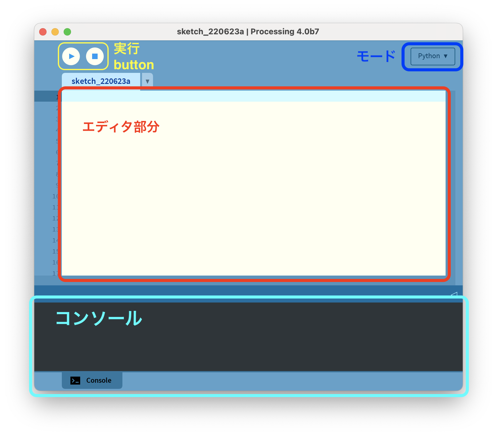

# py.Processing-animations
Animations with Processing Python Mode

## 最初に
Processingはサイトからダウンロードしてきてインストールするだけで、プログラミング環境が整います。
以下サイトからダウンロードしてください。寄付の必要はありません。「No Donation」にチェックを入れてください。
https://processing.org/download/

まずは初期設定です。Macならメニューバーの&#34;Processing&#34;のところをクリックして環境設定を選択してください。Windowsならファイル＞設定と進みます。
以下を設定してください。
- 言語を必要な言語に（日本語）にする
- エディタとコンソールのフォントをMacなら&#34;Osaka&#34;、Windowsなら&#34;Ms Gothic&#34;にする
- 複雑なテキスト入力を有効にするにチェックを入れる
- コード補完 Ctrl-spaceにチェックを入れる

設定したら、一度再起動して下さい。

