# py.Processing-animations
Animations with Processing Python Mode

## 最初に
Processingはサイトからダウンロードしてきてインストールするだけで、プログラミング環境が整います。
以下サイトからダウンロードしてください。寄付の必要はありません。「No Donation」にチェックを入れてください。
https://processing.org/download/

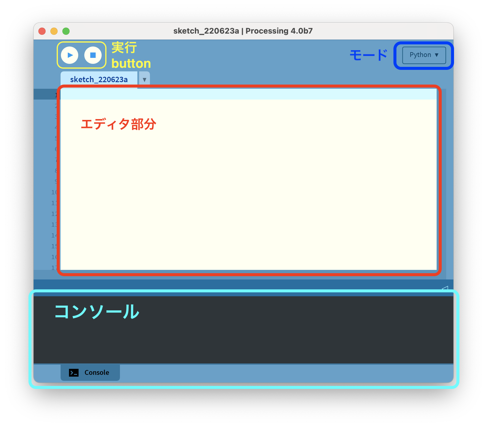

まずは初期設定です。Macならメニューバーの&#34;Processing&#34;のところをクリックして環境設定を選択してください。Windowsならファイル＞設定と進みます。
以下を設定してください。
- 言語を必要な言語に（日本語）にする
- エディタとコンソールのフォントをMacなら&#34;Osaka&#34;、Windowsなら&#34;Ms Gothic&#34;にする
- 複雑なテキスト入力を有効にするにチェックを入れる
- コード補完 Ctrl-spaceにチェックを入れる

設定したら、一度再起動して下さい。

## プログラムを実行してみよう
以下のプログラムをコード入力画面にコピー＆ペーストしてください。
```python=
#プログラムを実行したとき、始めに一回だけ実行されるブロック
def setup():
  size(500,500)  #ウィンドウのサイズを設定するメソッド。500x500に設定
  background(255,255,255) #背景色を設定する関数。白に設定
  fill(0,255,0) #図形の塗りつぶし色を設定するメソッド。緑に設定

#プログラムを実行したとき、ループして実行されるブロック
def draw():
    x = 250 #円の中心のx座標を表す変数、250を代入
    y = 250 #円の中心のy座標を表す変数、250を代入
    d = 300 #円の直径を表す変数、300を代入
    ellipse(x,y,d,d); #円（楕円）を描くメソッド
```
このプログラムを実行すると以下のような画像が表示されます。

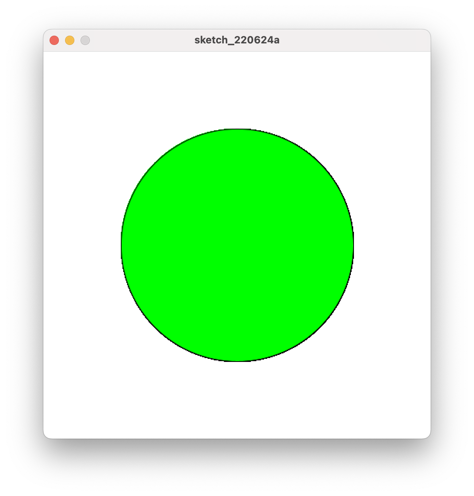

## 新規作成、保存、デバッグ

プログラムの新規作成、保存は、メニューの「ファイル」から項目を選んで実行します。もしくは、ショートカットキーでも行うことができます。  ファイルの保存場所ですが、書類フォルダの中に、Processing というフォルダがあります。例えば、`test1` という名前でプログラムを保存する場合、Processing フォルダの中に、`test1` フォルダができ、その中に `test1.pde` というプログラムファイルが保存されます。

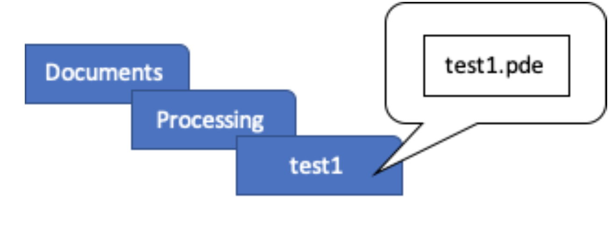

また、デバッグですが、下の「エラー」のタブをクリックすると、エラーメッセージとエラーの発生している行を確認することができます。

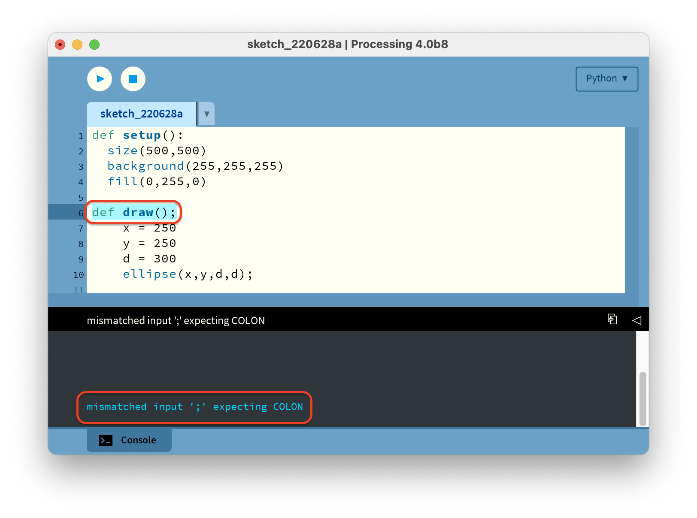

## 線 (Line)

線の書き方です。line 関数を使います。変数は 4つあり、はじめの 2つは、線の端の座標、次の 2つは、 線のもう一方の端の座標を書きます。例えば、このプログラムを実行すると以下のようになります。端の座標は、(30, 40) と (200, 80)です。
```python=
def setup():
  size(240,120)
  line(30,40,200,80)
```
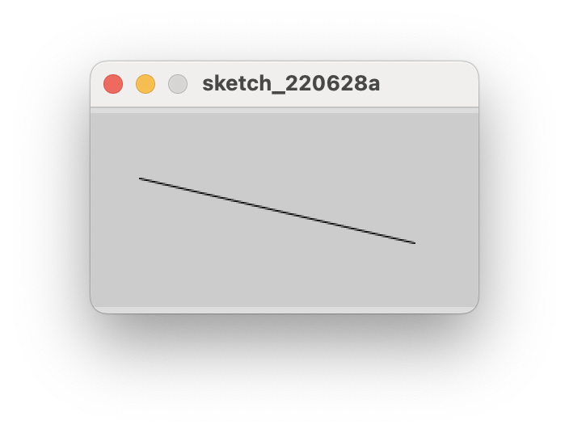

## 実行の順序
Processing は、先頭の命令から順に実行されます。したがって、重なり合う図形を描く場合、プログラム の実行順序は重要です。例えば、これらの二つのプログラムはどうなるでしょうか。先に書かれた命令から 実行されます。
```python=
def setup():
  size(120,100)
  ellipse(0,0,90,90)
  rect(20,30,60,50)
```
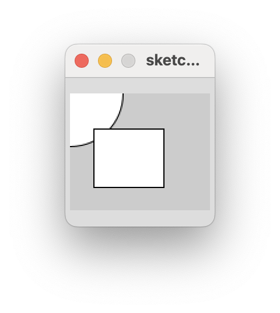

```python=
def setup():
  size(120,100)
  rect(20,30,60,50)
  ellipse(0,0,90,90)
```
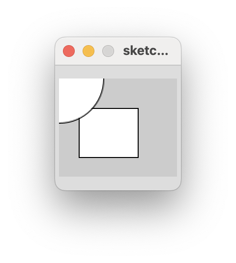

## 色 (Color)

Processing では、図形や背景に色をつけることができます。設定できる色は二種類あり、グレースケールと、RGBで指定する色です。まず、グレースケールの設定について説明します。グレーの色は `0`から `255`の値で表します。値が小さいほど暗く、値が大きいほど明るい色を表しています。この数値は、背景や図形の塗り潰しの関数の変数に書きます。
例えば、240かける 120のウィンドウを作り、background 関数で背景の色を指定します。ここでは、真っ黒を表す 0としています。 次に、図形の塗り潰しの色を `fill`関数で指定します。明るいグレーの色として、200としました。その次に円を描く関数を書いていますが、直前の色の指定が反映されるので、明るいグレーの円が描かれます。次にまた、fill 関数で暗いグレーとして 100を指定します。すると、次に描かれる円は、暗いグレーに塗り潰されています。試しに以下のプログラムを書いてみてください。

```python=
def setup():
  size(240,120)
  background(0)
  fill(200)
  ellipse(70,60,80,80)
  fill(100)
  ellipse(10,60,80,80)
```
## RGB

RGB カラーは、`赤(Red)`、`緑(Green)`、`青(Blue)`の 3つの数値で色を指定します。それぞれの数値は、0から 255の値をとり、グレースケールと同様に、値が小さいほど暗い色を表します。このプログラムは、4つの異なる色の円を描くプログラムです。
```python=
def setup():
  size(450,150)
  background(255)
  fill(255,0,0)
  rect(50,50,50,50)
  fill(0,255,0)
  rect(150,50,50,50)
  fill(0,0,255)
  rect(250,50,50,50)
  fill(100,20,80)
  rect(350,50,50,50)
```
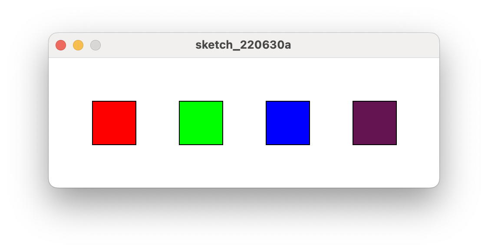

## 色の数値の確認

指定したい色が、どのような数値になるのか知りたいとき、カラーセレクターを使うと便利です。Processing のメニューの、「Tools」から、「color selector」を選択すると、以下の図のような画面が出てきます。自分の好きな色をクリックすると、その色に対応する RGBの値がわかります。

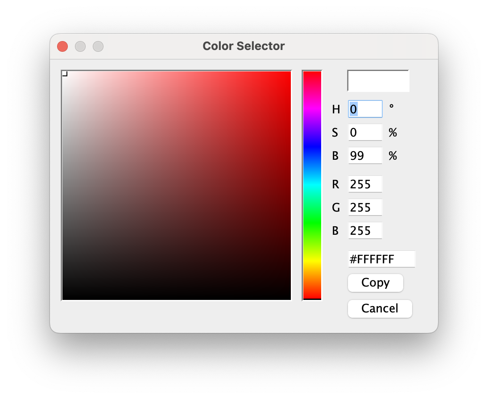

## 透明度

色の設定では、透明度も追加することができます。色を表す数値の後に、透明度を表す数値を追加します。値は 0から 255で、値が小さいほど透明、値が大きいほど不透明であることを表します。グレースケールの場合、色を表す数値と透明度を表す数値の、2つの数値で指定します。また、`RGB`のカラーの場合は、色を表す 3つの数値と透明度を表す数値の、全部で 4つの数値で指定します。このプログラムの例を見てみましょう。3つの円を描くプログラムですが、実行結果は以下のようになります。3つの円それぞれに色と透明度を指定しました。半透明なので、重なっているところの色が混ざっています。

```python=
def setup():
  size(400,200)
  noStroke ()                 #輪郭線を消す
  background (200, 226 , 225) #背景の色を変更する
  fill (255, 0, 0, 160)       #図形の色と透明度を指定する
  ellipse (150, 110, 90,90)   #円を描く
  fill (0, 255, 0, 160)
  ellipse(200, 60, 90, 90)
  fill (0, 0, 255, 160)
  ellipse (210, 130, 90, 90)
  ```
 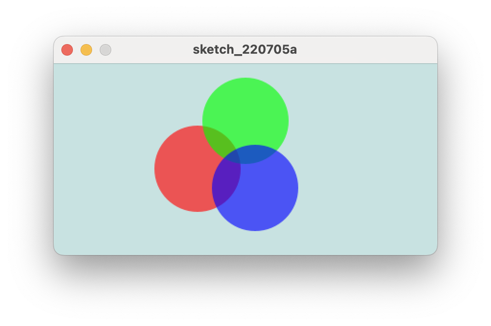
  
  ## 変数
  Processingは、他のプログラミング言語のように、変数を使うことができます。これにより、繰り返しの処理が簡単に表せるようになります。また、変数に対して足し算などの演算をすることもできます。この以下のプログラムを実行すると、3つの円が描かれます。これらの円は、y 軸に関して同じ高さ、等間隔、また、同じ大きさです。これらの同じ値を変数にすると、円を描く命令で毎回同じ数字を書く必要がなく、また、数値の変更も簡単になります。
```python=
size(400, 200)
#変数
x = 80
y = 100
d = 120
s = 80
ellipse(x, y, s, s)
ellipse(x+d, y, s, s)
ellipse(x+d∗2, y, s, s)
```

## 特別な変数
Processingには、いくつかの特別な変数があります。例えば、ウィンドウの幅と高さを表す、widthと heightです。これらの変数は宣言する必要はなく、ウィンドウのサイズを指定する `size` 関数の変数が自動的に代入されます。これらの値を使って、以下のようにウィンドウの対角線と中心に円を描くプログラムを考えます。まず、size関数でウィンドウを作ります。すると、`width`に 400、`height`に 200 が代入されます。これらの変数を使い、対角線や円の中心を表すことができます。

```python=
size(400,200)
line(0,0,width,height)
line(width,0,0,height)
ellipse(width/2, height/2, 100, 100)
```
 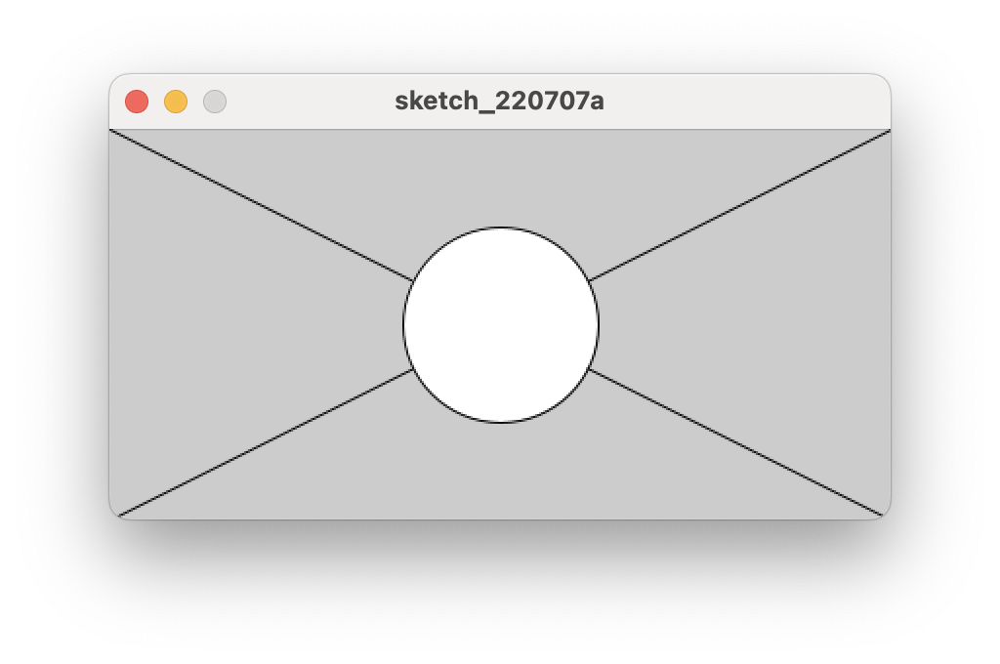
 
## 入力 `setup()` と `draw()`

今まで説明してきたプログラムは、上から順に実行し、最後まで実行すると終わるプログラムでした。マウスのクリックなど、外からの入力によって動きが変わるアニメーションを作りたい場合、そのプログラムはずっと動いている必要があります。そこで、`setup` 関数と`draw` 関数を使います。setup関数は、一度だけ実行される関数で、draw関数は、ストップボタンが押されるまで繰り返し実行される関数です。これらの関数が実行される様子を確認してみましょう。 print関数は、画面の下にあるコンソールに文字列や変数の値を表示する関数です。draw関数の方のフレームカウントという変数は、draw関数が上から下まで実行されることをフレームというのですが、そのフレームの数が格納されている特別な変数です。ちなみに、何も指定しない場合、1秒間に 60フレームで、この数は変更することができます。では、実行ボタンを押して、すぐ止めるボタンを押しましょう。そして、コンソールの横のスクロールバーで上まで戻ると、setup 関数は 一度だけしか表示されていないのに対して、draw 関数は何度も実行されているのが確認できます。
```python=
def setup():
  print("setup")
def draw():
  print(frameCount)
```
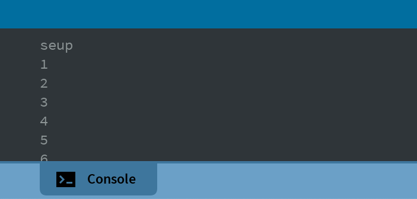

## 繰り返し処理

変数と `for`を使って繰り返しの処理ができます。変数 `width`と `height`の変数と、繰り返しの処理を使ったプログラムの例を二つ示します。1つ目のプログラムは、黒い背景を作って、二重の `for`ループで白い円とグレーの線を繰り返し書いています。これを実行すると、以下のようなグラフィックが出来上がります。

```pyhton=
size(400,200)
background(0)

for x in range(20, width-20, 10):
    for y in range(20, height-20, 10):
        fill(255,0,0)
        ellipse(x, y, 4, 4)
        stroke(100)
        line(x, y, width/2, height/2)
```
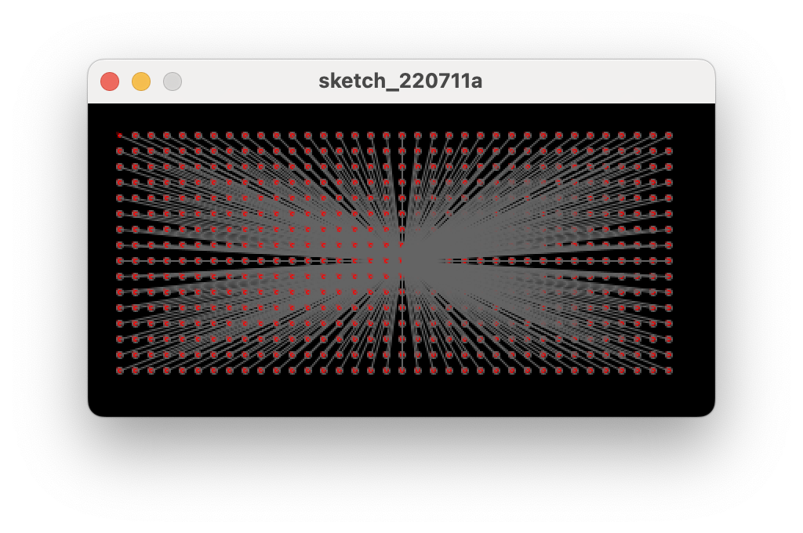

## 位置

先ほどのプログラムは、xの値がどんどん大きくなるので、途中から円は画面の外へ出て行ってしまいます。画面の中で表示し続けるには、物体の位置をウィンドウに収まるように調整する必要があります。例えば、先ほどのプログラムに、次に示すプログラムのように条件分岐を追加します。x の値がウィンドウの横幅を超えたら、左端に xの値を戻すという命令です。そうすると、出て行った円は再び左から現れるようになります。

## PixelArt

ピクセルアートはゲームとの結びつきが強いとはいえ、ピクセルアートはもはやゲーム文化の内部にとどまるものではありません。懐しさを楽しむ人、新しいグラフィック・スタイルとして楽しむ人、純粋にかわいいという点で楽しむ人、といったように楽しみ方は人それぞれだろうが、いずれにしろピクセルアートを描いたり鑑賞したりすることは、それ自体でひとつのカルチャーとして成り立っています。今回はprocessin上で`Pixelart`(ピクセルアート)画像を描いてみましょう。

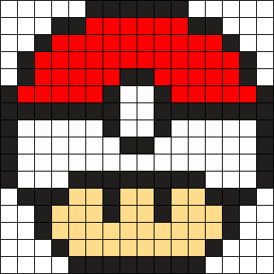
このポケモンボールの画像をを書いてみましょう
[Pixel_art_code] (https://github.com/asliddinxanov/py.Processing-animations/blob/main/pixel_art/art_pixel.pyde)

## 例題

今まで勉強してきた関数を使って様々なアニメーションを書いてみましょう。

例題１


